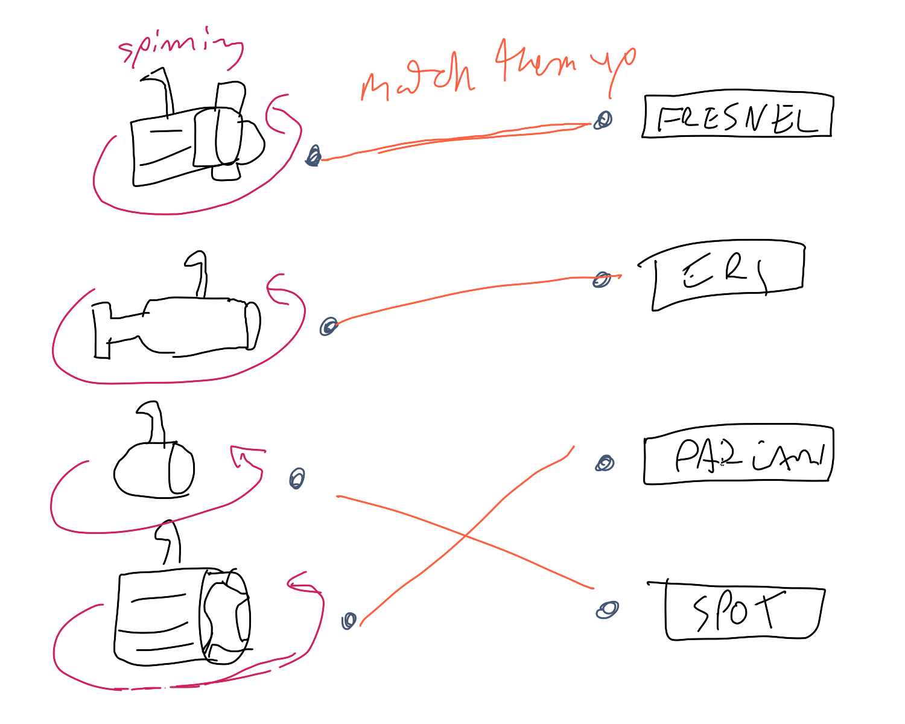
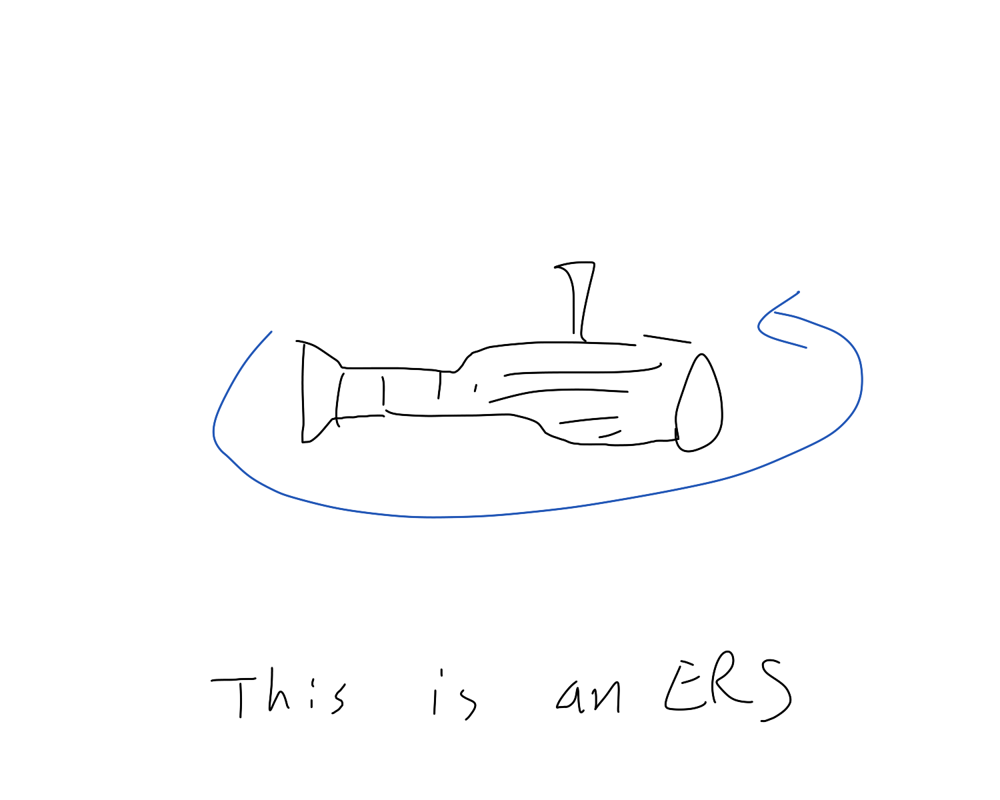
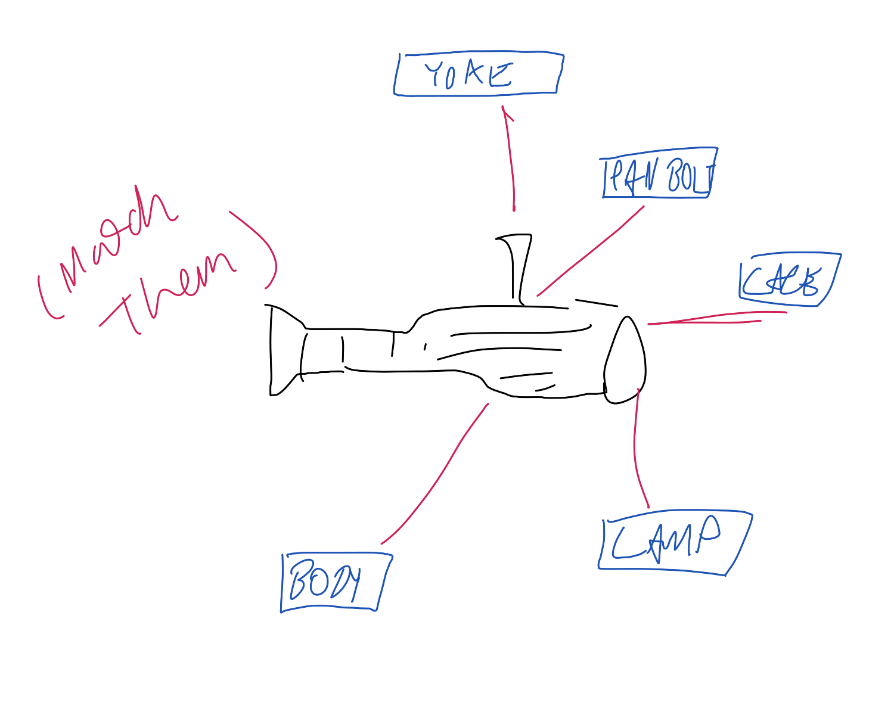
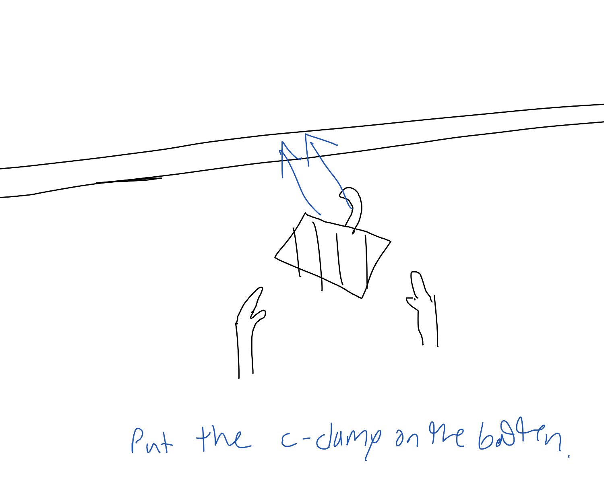
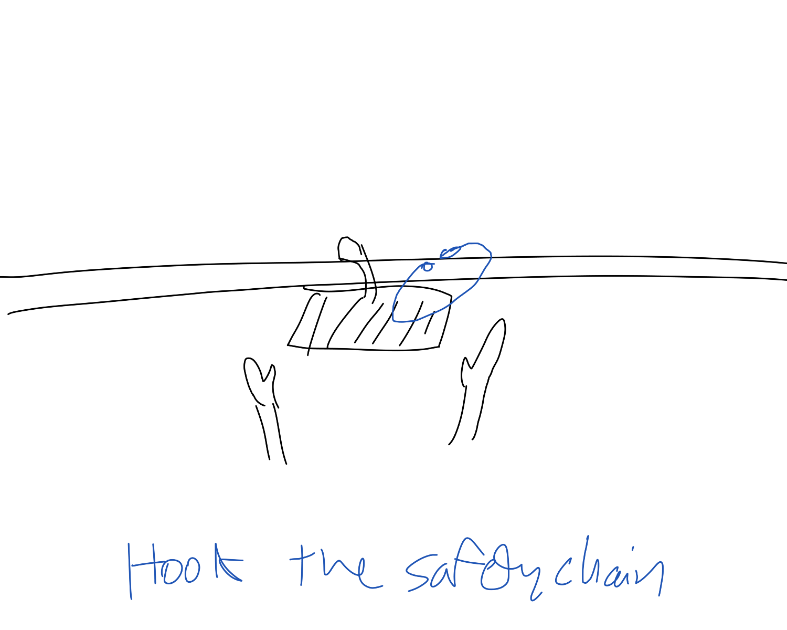
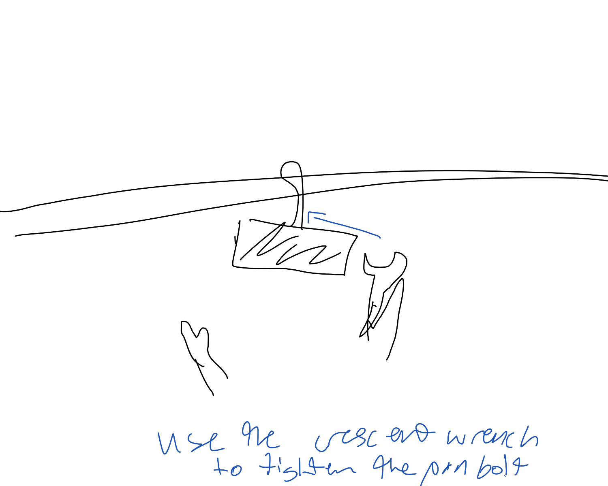
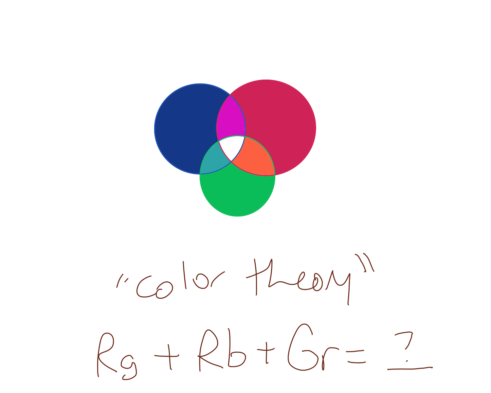
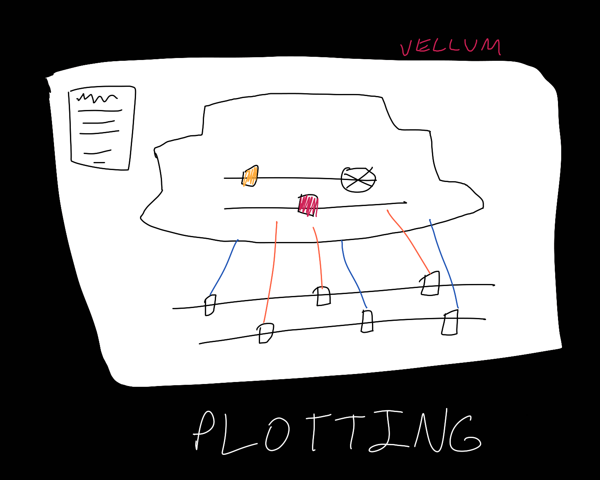
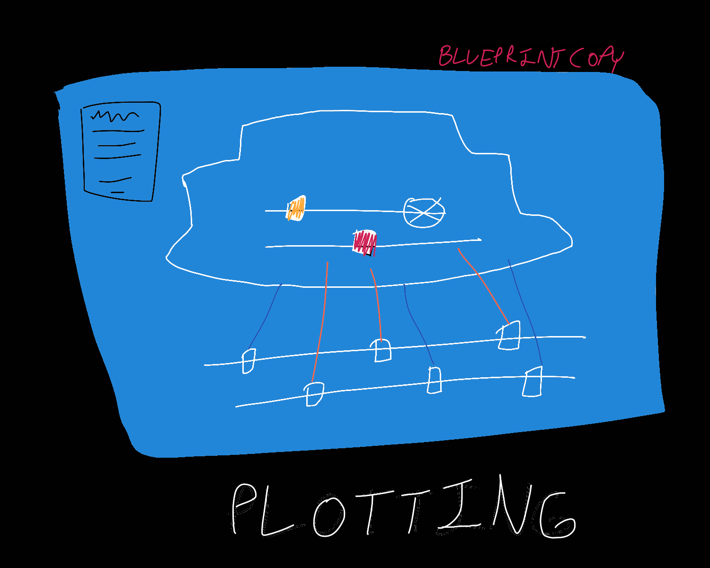

# Donaldson Final Design Document
### Gameplay description 
The game will walk through an educational lesson on lighting design including types of lights, hanging & focusing, color theory, design, and plotting. 
### Input
Basic clicking and dragging from user.
### Visual style
Basic and informative. Care should be taken on rendering the light output.
### Audio style
Simple clicks and mechanical noises to match gameplay.
### Interface sketches

### Bars
* The “low-bar “of you will create (this should still be a “complete game”)
All tasks except hanging and focusing and plotting (as these will be more interactive).
* A target that you expect to get done
All tasks (types of lights, hanging & focusing, color theory, design, and plotting)
* a desired high-bar if things go exceptionally well. Plan these out carefully, so that you can definitely achieve the first goal, and likely hit the second
It would be cool to set up some of the tasks (especially hanging/focus) in VR (in the SPRI lab).

### A timeline of what you need to accomplish and by when to complete your game on time. Look at the personal schedules, your classes and other projects, and plan accordingly.
11/14/19	Design Document Submission

11/18/19	Skeleton Setup; script written

11/21/19	Types of Light, Color Theory

11/25/19	Core Mechanic Playtesting

11/28/19	Design, Plotting

12/2/19		Hang & Focus

12/5/19		Start Polishing

12/12/19	Final Submission

